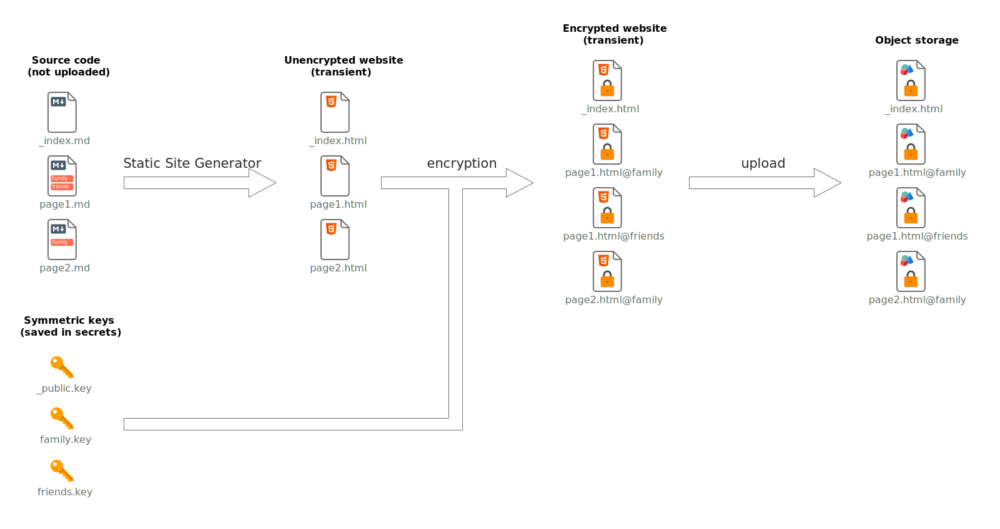
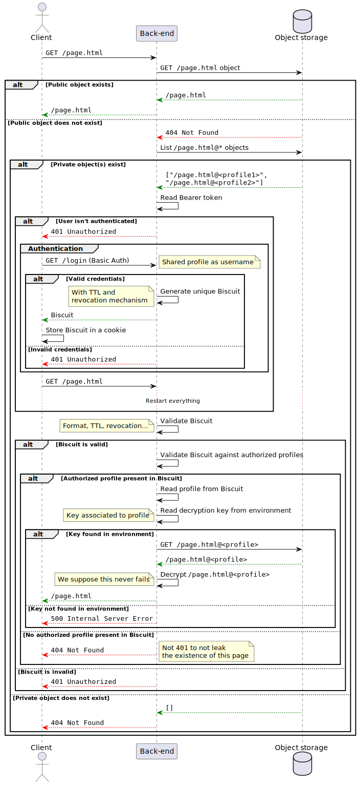
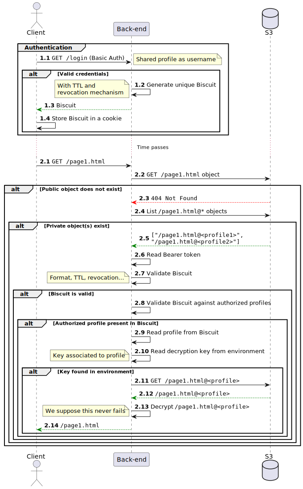
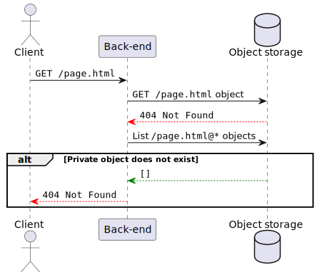

# Design

## Terminology

### Profile

TODO

### Encrypted/unencrypted

All files in the object storage are encrypted.

### Public/private

Files accessible without logging in are considered "public".
Those requiring at least one profile are considered "private".

## High level design

TODO

## Processes

### Static site generation, encryption and upload

1. Pages define which profiles can read them.
   No profile implies the page is public.

### Getting a resource

### Getting a private resource

Happy path:

The resource doesn't exist:

## Tests

- Create dummy blog with a private page, encrypt the website and then check that the private page's content
  doesn't appear anywhere in the encrypted files (using the "public" key).

  This checks for [Leakage of page existence](#leakage-of-page-existence).

## Known issues

### Leakage of page existence

**Problem:**

- Pages listing tags or categories have to be disabled to avoid leaking information.
- RSS feeds leak page existence and content.
- `index.json` in [Hugo](https://gohugo.io/) leaks private pages content.

**Solution:**

<!-- TODO -->

We will think about this later. There is certainly a solution.

### Images and videos must be encrypted too

**Problem:**

If images and videos are not encrypted, they are still publicly accessible over the Internet.

**Solution:**

<!-- TODO -->

We will think about this later. There is certainly a solution.

### Most paths cause a useless call to the object storage

**Problem:**

When getting a resource, we first check if a public version exists.
If the user is unauthenticated and the page isn't public,
we can abort without having to list all private objects.

However, if the user is authenticated, we then list all objects matching `<page>@*`.
If instead we listed objects matching `<page>*` in the first place,
we could have all the necessary information in one call.

For public pages this would result in two calls
(get the name of the object, then get its contents)
instead of one, but this would standardize the process of
getting the full object in a subsequent call
(which is already the case for encrypted pages).

**Solutions:**

1. Quick win: If listing objects matching a pattern is quick enough, we can just
   forget about the speed issue and do one call listing objects matching `<page>*`.
2. Better solution: If the user is authenticated, list objects matching `<page>*`.
   If not, get only the `<page>` object.

### What happens if an access is removed?

**Problem:**

If a page was accessible by a certain profile, but its access was removed,
the old encrypted version is still accessible by the

**Solutions:**

<!-- TODO -->

1. Overkill solution: Generate new keys on each update of the website
   then update the environment variables of the back-end server.

   Drawback: For a small period of time, there could be an issue where
   the page in the object storage is encrypted with a new key
   the back-end server doesn't have yet.
2. Better solution: Remove old objects after uploading the new ones.

We will think about this later. There is certainly a solution.
